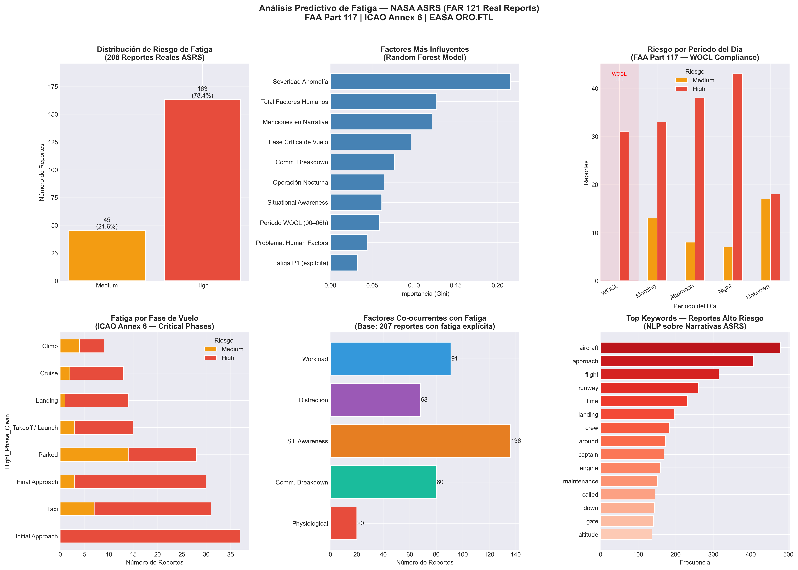

# Fatigue Risk Predictor ✈️

Predicción en tiempo real de riesgo de fatiga en tripulaciones de vuelo, basada en datos reales del **NASA Aviation Safety Reporting System (ASRS)** y entrenada con **Random Forest**.



Imagina que la NASA tiene un buzón de sugerencias secreto para pilotos.

Cualquier piloto comercial puede escribir de forma anónima:

*"Oye, esto casi sale mal en mi vuelo y aquí te cuento por qué".*

Nadie lo sanciona. Nadie lo juzga.

Es solo para aprender y mejorar la seguridad.

Eso es el **ASRS** (Sistema de Reporte de Seguridad en Aviación de la NASA).

Descargamos **208** de esos reportes reales escritos entre 2022 y 2026.

Todos relacionados con **fatiga** en aerolíneas comerciales bajo reglas de la **FAA**.

Analizamos las horas, las fases del vuelo, los factores humanos y las narrativas de los propios pilotos.

Construimos un modelo de **Machine Learning** y esto fue lo que encontramos:

---

## 📊 Dashboard

.png)

---

### 1. Distribución de Riesgo de Fatiga (Arriba a la izquierda)
**¿Qué muestra?** Cuántos de los vuelos reportados terminaron en una situación crítica.

**La conclusión:** No existe la fatiga "suave" en el aire. El **78.4%** (163 reportes) se clasificaron como Riesgo Alto y el resto como Medio. Ninguno fue de bajo riesgo. Si un piloto reporta fatiga, la situación ya es grave.

### 2. Factores Más Influyentes (Arriba al centro)
**¿Qué muestra?** Qué cosas mira el modelo de IA para saber si un vuelo va a ser de alto riesgo o no (de mayor a menor importancia).

**La conclusión:** Lo que más predice el peligro es la **Severidad de la Anomalía** (qué tan grave fue el error inicial) y el **Total de Factores Humanos** acumulados. El modelo aprende a "conectar los puntos" de estos factores para alertar sobre el riesgo.

### 3. Riesgo por Período del Día (Arriba a la derecha)
**¿Qué muestra?** A qué hora ocurren los reportes. Hay una zona sombreada en rojo llamada **WOCL** (Window of Circadian Low o Ventana de Mínimo Rendimiento Circadiano), que es la madrugada (02:00 a 06:00).

**La conclusión:** La biología no perdona. Aunque el volumen de vuelos es menor en la madrugada, el riesgo alto se dispara en esa ventana. Es el momento en que el cuerpo humano está programado para dormir, sin importar el café que tome el piloto.

### 4. Fatiga por Fase de Vuelo (Abajo a la izquierda)
**¿Qué muestra?** En qué momento del viaje se manifestaron los problemas.

**La conclusión:** Los peores incidentes (las barras rojas de alto riesgo) se concentran al final: **Aproximación Inicial, Taxi y Aproximación Final**. Es una combinación letal: el momento del vuelo que más concentración exige coincide con el momento en que el piloto lleva más horas despierto y acumulando fatiga.

### 5. Factores Co-ocurrentes con Fatiga (Abajo al centro)
**¿Qué muestra?** Qué otros problemas psicológicos u operacionales venían "escondidos" junto con la fatiga.

**La conclusión:** La fatiga nunca viaja sola. El gráfico demuestra que un piloto cansado pierde la **Conciencia Situacional** (saber qué está pasando a su alrededor, con 136 casos) y comete errores de **Carga de Trabajo (Workload)** y fallas de comunicación. La fatiga actúa como un **amplificador** de todos los demás errores humanos.

### 6. Top Keywords — Reportes Alto Riesgo (Abajo a la derecha)
**¿Qué muestra?** Las palabras que más repitieron los pilotos en sus textos libres al describir los momentos de alto riesgo.

**La conclusión:** Las palabras principales son *aircraft* (avión), *approach* (aproximación), *flight* (vuelo), *runway* (pista) y *landing* (aterrizaje). Esto nos confirma visualmente la historia del gráfico 4: las **emergencias reales por fatiga ocurren con aviones grandes intentando aterrizar en la pista con tripulaciones exhaustas**.

---

**En resumen:** El dashboard demuestra científicamente que la fatiga en aviación comercial no es un simple "tener sueño". Es un factor crítico que nubla la mente del piloto justo en el momento más peligroso del vuelo (el aterrizaje) y especialmente durante la madrugada.

---

## 🤖 ¿Por qué usamos Random Forest (Bosque Aleatorio) en el código?

Piénsalo así:

Si quieres decidir si un vuelo es riesgoso, podrías preguntarle a un solo experto. Pero ese experto puede tener sesgos.

El Bosque Aleatorio hace algo más inteligente.

Consulta a **200 expertos** al mismo tiempo. Cada uno mira el problema desde un ángulo diferente. Luego, toma la decisión que la mayoría recomienda.

Lo elegimos por **3 razones clave** para este proyecto:

- **Robusto con pocos datos:** Solo teníamos 208 reportes. Muchos algoritmos necesitan miles para funcionar; este modelo es fuerte con muestras pequeñas.
- **Es explicable:** No es una caja negra. Nos dice exactamente qué variables fueron decisivas, algo fundamental en aviación para justificar decisiones ante los reguladores.
- **No colapsa:** Si un reporte tiene datos raros o incompletos, el consenso de los "expertos" (árboles) salva el resultado.

**El resultado:** 90% de exactitud general y detectó el **98% de los casos de alto riesgo reales**.

En seguridad operacional, esto significa que el modelo casi no deja pasar ninguna situación crítica sin levantar una alerta.

---

## Stack

- **Python** — pandas, numpy, scikit-learn, streamlit
- **Modelo:** Random Forest (200 trees, max_depth=8, class_weight='balanced')
- **Dataset:** 208 reportes reales ASRS — Air Carrier FAR 121 Fatigue Reports

## Regulaciones

- FAA 14 CFR Part 117 — Flight & Duty Limitations
- ICAO Annex 6 — Operation of Aircraft
- EASA ORO.FTL — Flight Time Limitations

## Uso

```bash
pip install streamlit pandas numpy scikit-learn
streamlit run app.py
```

## Inputs del usuario

- Período circadiano (WOCL, Morning, Afternoon, Night)
- Fase de vuelo (crítica vs no crítica)
- Fatiga reportada por capitán y/o primer oficial
- Factores humanos concurrentes (workload, distraction, situational awareness, comm breakdown, physiological)
- Severidad de anomalía y menciones de fatiga en narrativa

## Salida

- Nivel de riesgo: 🟢 Low / 🟡 Medium / 🔴 High
- Probabilidades del modelo (porcentaje por clase)
- Alerta regulatoria según FAA Part 117 (§117.23 / §117.25)

## Archivos

| Archivo | Descripción |
|---------|-------------|
| `app.py` | Streamlit app de predicción en tiempo real |
| `fatigue_analysis-checkpoint.py` | Análisis completo del dataset ASRS + dashboard |
| `data.csv` | Dataset original NASA ASRS (208 reportes) |
| `fatigue_asrs_dashboard.png` | Dashboard generado con 6 gráficos |
| `Captura de pantalla (11).png` | Screenshot de la app en funcionamiento |

## Fuente

NASA Aviation Safety Reporting System — [asrs.arc.nasa.gov](https://asrs.arc.nasa.gov)
